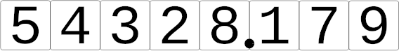

.. _square_root_ref:

.. |leq| unicode:: U+2264 .. less or equal

Square Root
===========

.. rst-class:: hidden

   This page describes the :index:`Square Root` algorithm

Algorithm Details
-----------------

We accompany the  algorithm description with a numeric example

.. code-block:: txt

   54328.179

**Initialisation phase**

1. | The first step is to make digits group starting at the decimal point and moving towards the most significant digit, and from the decimal towards the least significant digit.
   | The highest group can contain one digit (you may prepend a 0 to wmate it a proper 2-digit group, but this does not matter to the algorithm).
   | Let P be the number represented by the highest group.

.. code-block:: txt

   05|43|28.17|90    233.08405
   04                               2*2 = 4
   __
    1 43             
    1 29                           43*3 = 129
    ___  
      14 28
      13 89                       463*3 = 1'389
      _____
         39 17
             0                   4660*0 = 0
         _____
         39 17 90  
         37 28 64               46608*8 = 372'864
         ________
          1 89 26 00 
          1 86 46 56           466164*4 = 1'864'656
          __________
             2 79 44 00
                      0       4661680*0 = 0
             __________
             2 79 44 00 00
             2 33 08 40 25   46616805*5 = 233084025
             -------------
               46 35 59 75

2. | Now find the highest one-digit number *s* whose square is less than *P*-
   | The digit *s* is the first digit of the solution.

3. | Subtract *s*\ :sup:`2` from the leading group yielding a number *r*: *r* = *P* -  *s*\ :sup:`2`.

Here follows a loop which produces an additional digit of the solution in each iteration.

1. | if there still are more digit pairs left from the argument, then append the next on to *r* yielding *r'*.
   | if there are no more digit pairs,, append '00' to *r* yielding *r'*

2. | if the select digit pair is the first **after** the deimal point, add a decimal point to the solution.

3. | form a number *L* from the current digits, double it and then multply it by 10 (i.e. multiply the base *b*), h = 10*2*L

4. | find the highest digit *x*, such that p = x * (h + x) |leq| r'  
   | the digit x is the next digit of the solution, so append it to L: L = Lx

5. | Subtract the product *p* from *r'* to get the new value of *r*

6. | If the number of digits of ther solution is sufficient, exit the loop; otherwise go to step 1

