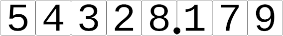
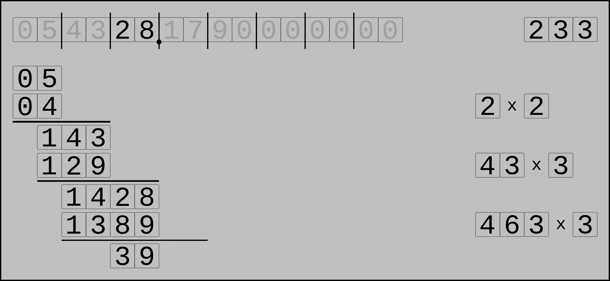
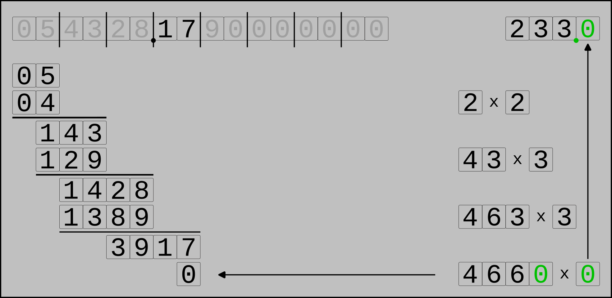
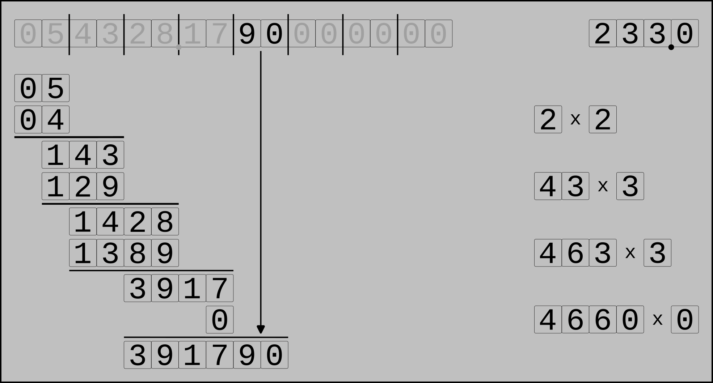
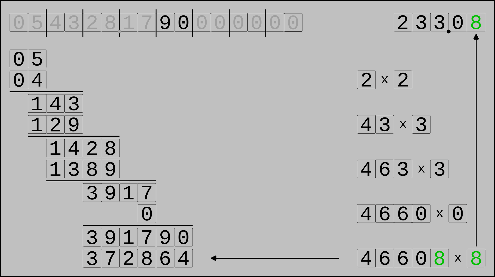
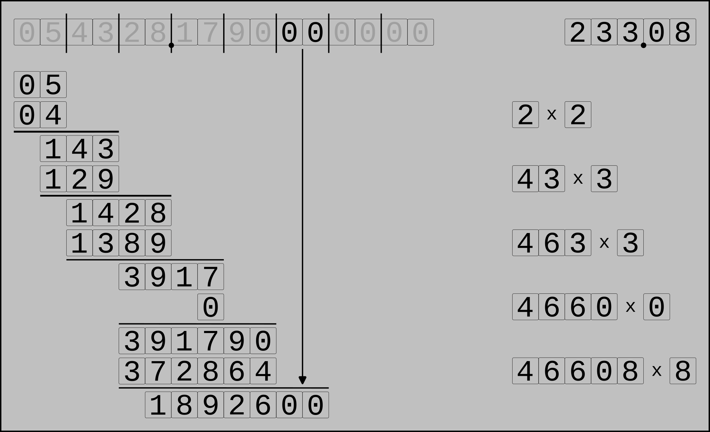
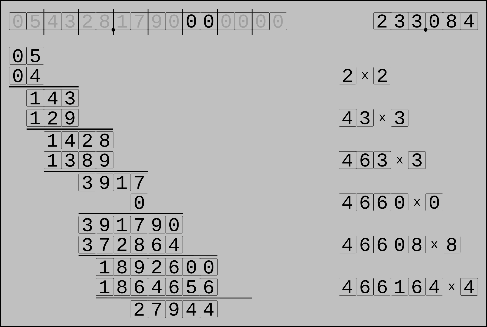
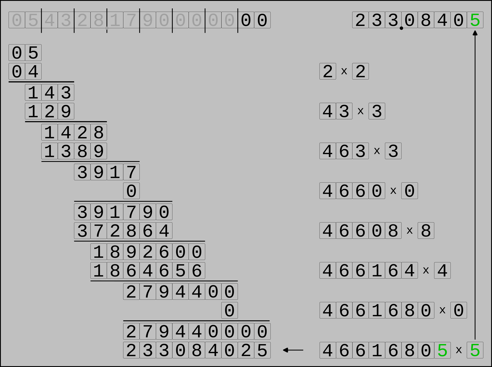

.. _square_root_example_ref:

.. |leq| unicode:: U+2264 .. less or equal

Square Root Example
===================

.. rst-class:: hidden

   This page describes the :index:`Square Root Example` algorithm

We start with the number 

and prepare it like this

.. figure:: ../../images/sqrt_init_01.png

Now get the first pair P

and find the largest number whose square is less or egual to P:

This number is the first digit of our result.

Calculate the reminder:

Get the next pair and append it to the reminder

.. figure:: ../../images/sqrt_it_1_loop_1.png

Now find a number x so that x * (20*s + x) is less than or equal to the remainder, where s consists of the current solution's digits.  
This number is the next digit of the solution.
In this case we have 3*(40+3) = 129 < 143.

Get the remainder

.. figure:: ../../images/sqrt_it_1_loop_3.png

We repeat the loop again: append the next pair to the remainder

find the number satisfying x*(202*s + x) |leq| r

append this number to the solution digits and calculate the remainder

The next iteration again begins by expanding the remainder with the next pair of input digits,
but because it is the first pair after the input's decinal point we must add the decimal point to the solution.

Determine the next splution digit

And find the remainder

.. figure:: ../../images/sqrt_it_3_loop_3.png

For the fifth solution digit we again append the next pair to the remainder

Calculate the actual solution digit

and write the remainder

Another iteration

And another

And a last iteration

