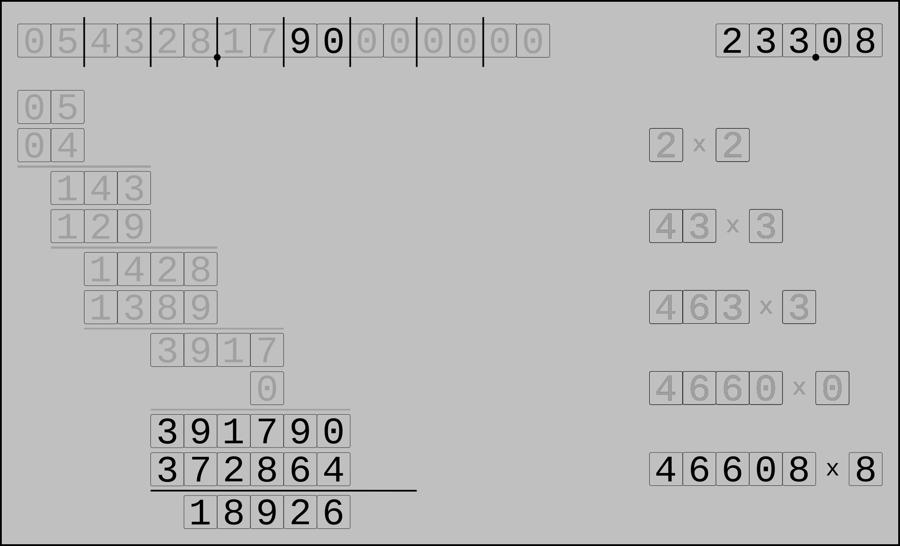
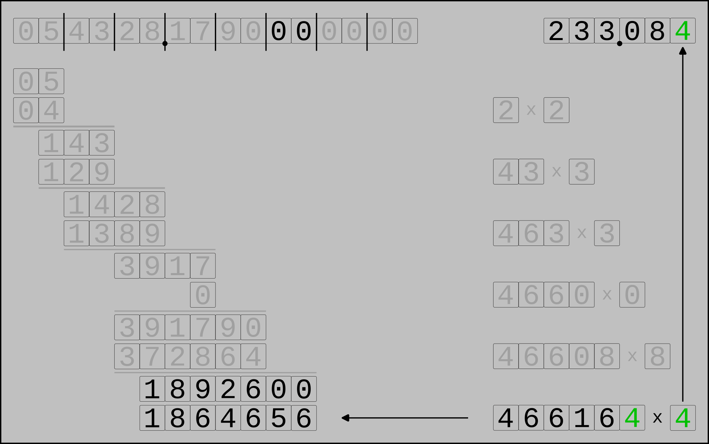

.. _square_root_example_ref:

.. |leq| unicode:: U+2264 .. less or equal

Square Root Example
===================

.. rst-class:: hidden

   This page describes the :index:`Square Root Example` algorithm

We start with the number 

.. figure:: ../../images/sqrt_init_00.png

and prepare it like this

.. figure:: ../../images/sqrt_init_01.png

Now get the first pair :math:`P`

and find the largest number :math:`s` whose square is less or egual to :math:`P`:

This number is the first digit of our result.

Calculate the remainder:

Get the next pair and append it to the remainder

.. figure:: ../../images/sqrt_it_1_loop_1B.png

Now find the largest number :math:`x` such that :math:`x \times (20 \times s + x)` is less than or equal to the remainder :math:`r=143`, where :math:`s` consists of the current solution's digits ("2").  
This number is the next digit of the solution.
In this case we have :math:`3 \times (40+3) = 129 < 143`.

Get the remainder

We repeat the loop again: append the next pair to the remainder

The largest number :math:`x` satisfying :math:`x \times (20 \times 23 + x) \leq 1428` is :math:`x=3`

append this number to the solution digits and calculate the remainder

The next iteration again begins by expanding the remainder with the next pair of input digits,
but because it is the first pair after the input's decimal point we must add the decimal point to the solution.

Determine the next solution digit. Here the value :math:`20 \times 233 = 4660` is greater than :math:`3917`, so the next digit of the solution is 0. 

.. figure:: ../../images/sqrt_it_3_loop_2B.png

And find the remainder

For the fifth solution digit we again append the next pair to the remainder

Calculate the actual solution digit

and write the remainder

Another iteration. From now on, the appended pairs are always "00", since we've used up all digits of the original number.

The next digit of the solution is 4, because :math:`4 \times 466164 = 1864656 < 1892600`, whereas :math:`5 \times 466164 = 2330825 > 1892600`.

And another one: get the next pair of digits ...

... find the next digit of the solution ...

... and calculate the reminder

.. figure:: ../../images/sqrt_it_6_loop_3B.png

And a last iteration

So we have

.. math::

     \Huge {\sqrt{54328.179} \approx 233.08405}

Of course this can be continued for an arbitrary number of digits:

.. math::

    \sqrt{54328.179} \approx 233.084059944046795814499796642841476428333458527718069590522040979...